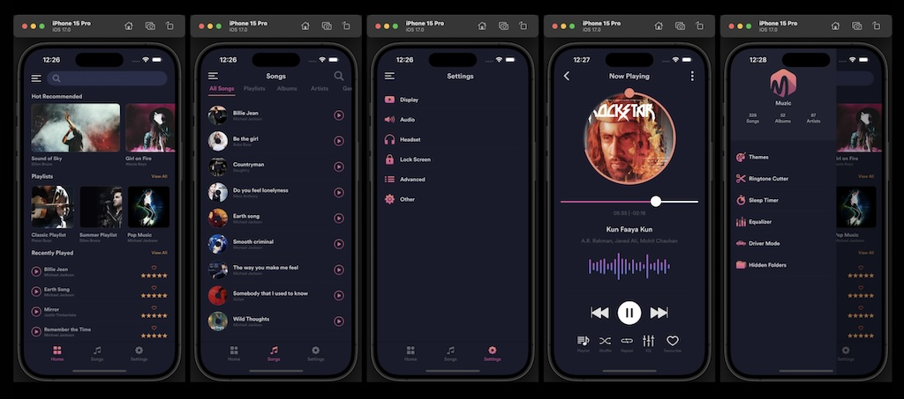

# SwiftUI与MVVM的最佳音乐播放器应用程序

# codeforany @codeforany

🎶踏上使用MVVM架构在SwiftUI中构建时尚且功能丰富的音乐播放器应用程序的旅程。在本综合教程中，我们将指导您通过飞溅屏幕、底部选项卡视图、主屏幕、侧菜单、歌曲库、播放列表、专辑、艺术家档案、流派、播放功能和设置屏幕来创建迷人的用户体验。

### 效果图

🚀 主要亮点：

1） MVVM体系结构：学习使用模型-视图-视图模式构建应用程序，以获得可维护和有组织的代码。
2） 飞溅屏幕：创建一个引人入胜的飞溅屏幕，给人留下深刻的第一印象。
3） 底部选项卡视图：实现一个光滑的底部选项卡视图，以便在不同的应用程序部分之间轻松导航。
4） 主屏幕：设计一个动态的主屏幕，以显示特色内容和快速链接。
6） 侧边菜单：制作一个直观的侧边菜单，无缝访问应用程序部分。
7） 歌曲库：建立一个全面的歌曲库，供用户探索和欣赏。
8） 播放列表、唱片集、艺术家详细信息：创建交互式屏幕以查看播放列表、专辑和艺术家详细信息。
9） 流派和播放歌曲：允许用户按流派探索音乐并播放他们喜欢的曲目。
10） 设置屏幕：设计一个用户友好的自定义设置屏幕。

🎵 提升您的SwiftUI技能：

无论您是SwiftUI爱好者还是初学者，本教程都提供了创建令人印象深刻的音乐播放器应用程序的分步说明。增强您的SwiftUI技能，掌握MVVM架构，构建以用户为中心的应用程序。

🔥 让我们开始：

如果你觉得这个教程很有价值，请竖起大拇指，与其他开发人员分享，并订阅我们的频道，了解更多令人兴奋的SwiftUI教程。加入我们的学习者社区，成为SwiftUI专业人士！

让音乐播放吧！ 🎶🎧🎤

👍 别忘了点赞视频，订阅频道，点击通知铃，了解更多令人兴奋的SwiftUI教程。

🙏 感谢您加入我们的创意之旅！我们很高兴您能和我们一起为本地iOS开发创新的在线杂货店应用程序。

- [Youtube完整播放列表：Swift UI Native iOS音乐播放器应用程序从头开始开发|MVVM架构|分步指南](https://www.youtube.com/playlist?list=PLzcRC7PA0xWTRhFuIAY6ZdUP62X0DdttE)

- [Youtube频道：@codeforany](https://www.youtube.com/channel/UCdQTp9wRK5vAOlEQZf9PHSg)

- [Youtube频道订阅：@codeforany](https://www.youtube.com/channel/UCdQTp9wRK5vAOlEQZf9PHSg?sub_confirmation=1)

UI用户体验应用程序设计: [Akila Weerakoon](https://www.behance.net/gallery/108639283/Meal-Monkey-Food-delivery-iOS-mobile-application)
